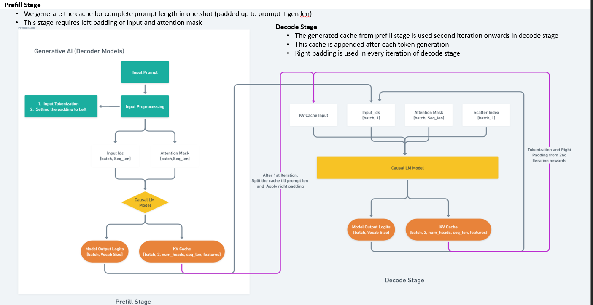

<p align="center">
  <picture>
    
  </picture>
</p>

---
# Qualcomm Transformers Library 

---

*Latest news* :fire: <br>

- [coming soon] Support for more popular [models](#models-coming-soon) and inference optimization techniques like continuous batching and speculative decoding <br>
- [05/2024] Added support for [Mixtral-8x7B](https://huggingface.co/mistralai/Mixtral-8x7B-v0.1) & [Mixtral-8x7B](https://huggingface.co/mistralai/Mixtral-8x7B-v0.1).
- [04/2024] Initial release of [efficient transformers](https://github.com/quic/efficient-transformers) for seamless inference on pre-trained LLMs.

## Train anywhere, Infer on Qualcomm Cloud AI with a Developer-centric Toolchain

This library provides reimplemented blocks of LLMs which are used to make the models functional and highly performant on Qualcomm Cloud AI 100.
There are several models which can be directly transformed from a pre-trained original form to a deployment ready optimized form.
For other models, there is comprehensive documentation to inspire upon the changes needed and How-To(s).

## Typically for LLMs, the library provides:
1. Reimplemented blocks from Transformers <link> which enable efficient on-device retention of intermediate states.
2. Graph transformations to enable execution of key operations in lower precision
3. Graph transformations to replace some operations to other mathematically equivalent operations
4. Handling for underflows and overflows in lower precision
5. Patcher modules to map weights of original model's operations to updated model's operations
6. Exporter module to export the model source into a ONNX Graph.
7. Sample example applications and demo notebooks
8. Unit test templates. 

**It is mandatory for each Pull Request to include tests such as**:
1. If the PR is for adding support for a model, the tests should include successful execution of the model post changes (the changes included as part of PR) on Pytorch and ONNXRT. Successful exit criteria is MSE between output of original model and updated model.
2. If the PR modifies any common utilities, tests need to be included to execute tests of all models included in the library.


## Validated Models

* [GPT2](https://huggingface.co/openai-community/gpt2)
* [Llama-3-8b](https://huggingface.co/meta-llama/Meta-Llama-3-8B)
* [Llama-3-70b](https://huggingface.co/meta-llama/Meta-Llama-3-70B)
* [Llama-2-70b](https://huggingface.co/meta-llama/Llama-2-70b-chat-hf)
* [Llama-2-7b-chat-hf](https://huggingface.co/meta-llama/Llama-2-7b-chat-hf)
* [Llama-2-13b-chat-hf](https://huggingface.co/meta-llama/Llama-2-13b-chat-hf)
* [CodeLlama-7b-hf](https://huggingface.co/codellama/CodeLlama-7b-hf)
* [CodeLlama-13b-hf](https://huggingface.co/codellama/CodeLlama-13b-hf)
* [CodeLlama-34b-hf](https://huggingface.co/codellama/CodeLlama-34b-hf)
* [Salesforce/codegen25-7b-mono_P](https://huggingface.co/Salesforce/codegen25-7b-mono_P)
* [Salesforce/xgen-7b-8k-base](https://huggingface.co/Salesforce/xgen-7b-8k-base)
* [MPT-7b](https://huggingface.co/mosaicml/mpt-7b)
* [Mistral-7B-Instruct-v0.1](https://huggingface.co/mistralai/Mistral-7B-Instruct-v0.1)
* [Mixtral-8x7B](https://huggingface.co/mistralai/Mixtral-8x7B-v0.1)

## Models Coming Soon
 
* [Falcon-40b](https://huggingface.co/tiiuae/falcon-40b) 
* [Starcoder2-15b](https://huggingface.co/bigcode/starcoder2-15b) 
* [Phi-3](https://huggingface.co/microsoft/Phi-3-mini-128k-instruct)
* [Jais-13b](https://huggingface.co/core42/jais-13b)
* [Jais-30b](https://huggingface.co/core42/jais-30b-chat-v1)
* [GPT-J-6B](https://huggingface.co/EleutherAI/gpt-j-6b)
* [Chatglm2-6b](https://huggingface.co/THUDM/chatglm2-6b)
* [Baichuan2-7B-Base](baichuan-inc/Baichuan2-7B-Base)


## Requirements
System Requirements:
1. [Supported Linux OS](https://quic.github.io/cloud-ai-sdk-pages/latest/Getting-Started/Installation/#operating-systems) - Ubuntu, RHEL and AWS Linux 
2. [Pre-requisites installed](https://quic.github.io/cloud-ai-sdk-pages/latest/Getting-Started/Installation/Pre-requisites/pre-requisites/)
3. [Cloud AI 100 Platform and Apps SDK installed](https://quic.github.io/cloud-ai-sdk-pages/latest/Getting-Started/Installation/Cloud-AI-SDK/Cloud-AI-SDK/)  
4. [Multi-device support enabled for model sharding](https://github.com/quic/cloud-ai-sdk/tree/1.12/utils/multi-device)

:bulb:  Use bash terminal

:memo: If using ZSH terminal then "device_group" should be in single quotes e.g.  "--device_group '[0]'"

## Installation 
```bash
# Create Python virtual env and activate it. (Required Python 3.8)
 
# Login to the Cloud AI 100 Server.
ssh -X username@hostname

python3.8 -m venv qeff_env
source qeff_env/bin/activate
 
# Clone the QEfficient Repo.
 
# Install the qefficient-library in Host machine (Used for CLI APIs) (Until we have docker integrated in Apps SDK)
pip install -e .
```

# Quick Start Guide

QEfficient Library was designed with one goal: **to make onboarding of models inference straightforward for any Transformer architecture, while leveraging the complete power of Cloud AI platform**

To achieve this, we have 2 levels of APIs, with different levels of abstraction.
1. High-level APIs abstract away complex details, offering a simpler interface. They're ideal for quick development and prototyping. If you're new to a technology or want to minimize coding effort, high-level APIs are more user-friendly.

2. Low-level APIs offer more granular control, ideal for when customization is necessary. These are particularly useful for users who are trying their own models, not hosted on HF but are implemented based on Transformers.

In summary:

* Choose high-level APIs for quick development, simplicity, and ease of use.
* Opt for low-level APIs when you need fine-tuned control, optimization, or advanced customization.


## Using High Level APIs
<div align="">

| High Level APIs | Sample use | Arguments         |
|-----------------|------------|-------------------|
| QEfficient.cloud.infer           |   [click here](#1-use-qefficientcloudinfer)         |  <li>model_name : $\color{green} {Mandatory}$</li> <li>num_cores : $\color{green} {Mandatory}$</li> <li>device_group : $\color{green} {Mandatory}$</li><li>batch_size : Optional [Default-1]</li> <li>prompt_len : Optional [Default-32]</li> <li>ctx_len : Optional [Default-128]</li><li>mxfp6 : Optional </li> <li>mxint8 : Optional </li><li>hf_token : Optional </li><li>cache_dir : Optional ["cache_dir" in current working directory]</li><li>**prompt : Optional</li><li>**prompts_txt_file_path : Optional</li>|
| QEfficient.cloud.execute  |     [click here](#2-use-of-qefficientcloudexcute)       |   <li>model_name : $\color{green} {Mandatory}$</li> <li>device_group : $\color{green} {Mandatory}$</li><li>qpc_path : $\color{green} {Mandatory}$</li><li>prompt : Optional [Default-"My name is"]</li> <li>cache_dir : Optional ["cache_dir" in current working directory]</li><li>hf_token : Optional </li><li>**prompt : Optional</li><li>**prompts_txt_file_path : Optional</li> |

**One argument, prompt or prompts_txt_file_path must be passed.**

### 1. Use QEfficient.cloud.infer 

This is the single e2e python api in the library, which takes model_card name as input along with other compile args if necessary and does everything in one go. 

* Torch Download → Optimize for Cloud AI 100 → Export to ONNX → Verify (CPU) → Compile on Cloud AI 100 → [Execute](#2-use-of-qefficientcloudexecute)
* It skips the ONNX export/compile stage if ONNX file or qpc found on path


```bash
# Check out the options using the help menu
python -m QEfficient.cloud.infer --help
python -m QEfficient.cloud.infer --model_name gpt2 --batch_size 1 --prompt_len 32 --ctx_len 128 --mxfp6 --num_cores 16 --device_group [0] --prompt "My name is" --mos 1 --aic_enable_depth_first  

# If executing for batch size>1,

# Either pass input prompts in single string but seperate with pipe (|) symbol". Example below

python -m QEfficient.cloud.infer --model_name gpt2 --batch_size 3 --prompt_len 32 --ctx_len 128 --num_cores 16 --device_group [0] --prompt "My name is|The flat earth 
theory is the belief that|The sun rises from" --mxfp6 --mos 1 --aic_enable_depth_first

# Or pass path of txt file with input prompts, Example below, sample txt file(prompts.txt) is present in examples folder .

python -m QEfficient.cloud.infer --model_name gpt2 --batch_size 3 --prompt_len 32 --ctx_len 128 --num_cores 16 --device_group [0] --prompts_txt_file_path examples/prompts.txt --mxfp6 --mos 1 --aic_enable_depth_first  
 ```
### 2. Use of QEfficient.cloud.execute

Once we have compiled the QPC, we can now use the precompiled QPC in execute API to run for different prompts, like below:

```bash
python -m QEfficient.cloud.execute --model_name gpt2 --qpc_path qeff_models/gpt2/qpc_16cores_1BS_32PL_128CL_1devices_mxfp6/qpcs --prompt "Once upon a time in" --device_group [0]  
```

We can also enable MQ, just based on the number of devices. Based on the "--device-group" as input it will create TS config on the fly. If "--device-group [0,1]" it will create TS config for 2 devices and use it for compilation, if "--device-group 0" then TS compilation is skipped and single soc execution is enabled.

```bash
python -m QEfficient.cloud.infer --model_name Salesforce/codegen-2B-mono --batch_size 1 --prompt_len 32 --ctx_len 128 --mxfp6 --num_cores 16 --device-group [0,1] --prompt "def fibonacci(n):" --mos 2 --aic_enable_depth_first  
 
# Once qpc is saved, you can use the execute API to run for different prompts
python -m QEfficient.cloud.execute --model_name Salesforce/codegen-2B-mono --qpc-path qeff_models/Salesforce/codegen-2B-mono/qpc_16cores_1BS_32PL_128CL_2devices_mxfp6/qpcs --prompt "def binary_search(array: np.array, k: int):" --device-group [0,1] 
 
# To disable MQ, just pass single soc like below:
python -m QEfficient.cloud.infer --model_name gpt2 --batch_size 1 --prompt_len 32 --ctx_len 128 --mxfp6 --num_cores 16 --device-group [0] --prompt "My name is" --mos 1 --aic_enable_depth_first
```


| High Level APIs | Single SoC | Tensor Slicing         |
|-----------------|------------|-------------------|
| QEfficient.cloud.infer           | python -m QEfficient.cloud.infer --model_name $\color{green} {model}$  --batch_size 1 --prompt_len 128 --ctx_len 1024 --num_cores 16 --device-group [0] --prompt "My name is" --mxfp6 --hf_token  $\color{green}{xyz}$  --mos 1 --aic_enable_depth_first |  python -m QEfficient.cloud.infer --model_name $\color{green}{model}$  --batch_size 1 --prompt_len 128 --ctx_len 1024--num_cores 16 --device-group [0,1,2,3] --prompt "My name is" --mxfp6 --hf_token  $\color{green}{xyz}$  --mos 4 --aic_enable_depth_first |
| QEfficient.cloud.execute  |   python -m QEfficient.cloud.execute --model_name $\color{green}{model}$  --device_group [0] --qpc_path  $\color{green}{path}$  --prompt "My name is"  --hf_token  $\color{green}{xyz}$   |  python -m QEfficient.cloud.execute --model_name $\color{green}{model}$  --device_group [0,1,2,3] --qpc_path  $\color{green}{path}$  --prompt "My name is"  --hf_token  $\color{green}{xyz}$   |

:memo: Replace $\color{green}{model}$ ,  $\color{green}{path}$  and  $\color{green}{xyz}$  with preffered model card name, qpc path and hf token respectively.


## Using Low Level APIs


<div align="left">

| Low Level APIs | Sample use | Arguments         | 
|-----------------|------------|-------------------|
|  QEfficient.transform    |   [click here](#1-model-download-and-transform)         |  <li>model : $\color{green} {Mandatory}$</li><li>Type : Optional [Default- "Transformers"]</li> <li>form_factor : Optional [Default-"cloud"]</li>  | 
| qualcomm_efficient_converter |     [click here](#2-onnx-export-of-transformed-model)       |   <li>mode_name : $\color{green} {Mandatory}$</li><li>model_kv : $\color{green} {Mandatory}$ [Optional when model_class passed] </li><li>model_class : $\color{green} {Mandatory}$ [Optional when model_kv passed]</li> <li>tokenizer : Optional</li><li>onnx_path : Optional </li><li>hf_token : Optional</li><li>seq_length : Optional [Default-128]</li><li>input_str : Optional [Default-"My name is"]</li><li>kv : Optional [Default-$\color{green} {True}$]</li><li>return_path : Optional [Default-False]</li><li>form_factor : Optional [Default-"cloud"]</li><li>save_fp32_onnx : Optional [Default-False]</li><li>save_fp16_onnx : Optional [Default-True]</li> <li>*Both save_fp32_onnx and save_fp16_onnx can't be false*</li> | 
|     compile | [click here](#3-compile-on-cloud-ai-100) | <li>onnx_path : $\color{green} {Mandatory}$</li><li>qpc_path : $\color{green} {Mandatory}$</li><li>num_cores : $\color{green} {Mandatory}$</li><li>device_group  : $\color{green} {Mandatory}$</li> <li>batch_size : Optional [Default-1]</li> <li>prompt_len : Optional [Default-32]</li><li>ctx_len : Optional [Default-128]</li><li>mxfp6 : Optional [Default-True]</li>| 
|cloud_ai_100_exec_kv | [click here](#4-run-benchmark)  | <li>batch_size : $\color{green} {Mandatory}$</li> <li>tokenizer : $\color{green} {Mandatory}$</li> <li>qpc_path : $\color{green} {Mandatory}$</li><li>**prompt : Optional</li><li>**prompts_txt_file_path : Optional</li><li>input_len : Optional [Default-None]</li> <li>generation_len : Optional [Default-None]</li> <li>device_id : Optional [Default-[0]]</li> <li>enable_debug_logs : Optional [Default-False]</li> <li>stream : Optional [Default-True]</li> <li>write_io_dir : Optional</li><li>automation : Optional [Default-False]</li>| 

**One argument, prompt or prompts_txt_file_path must be passed.


### 1.  Model download and transform

Initialize QEfficient and transform the models, Check the list of supported architectures in the repo.

```bash
# Initiate the Orignal Transformer model
import os
from transformers.models.gpt2.modeling_gpt2 import GPT2LMHeadModel
import QEfficient
from transformers import AutoTokenizer
from QEfficient.utils import hf_download
from QEfficient.utils.constants import Constants
# Please uncomment and use appropriate Cache Directory for transformers, in case you don't want to use default ~/.cache dir.
# os.environ["TRANSFORMERS_CACHE"] = "/local/mnt/workspace/hf_cache"

ROOT_DIR = os.path.dirname(os.path.abspath(""))

# Model-Card name to be onboarded (This is HF Model Card name) : https://huggingface.co/gpt2-xl

model_name = "gpt2" 

# Similar, we can change model name and generate corresponding models, if we have added the support in the lib.

model_hf_path = hf_download(repo_id=model_name, cache_dir=Constants.CACHE_DIR, ignore_pattrens=["*.txt", "*.onnx", "*.ot", "*.md", "*.tflite", "*.pdf"])
model_hf = GPT2LMHeadModel.from_pretrained(model_hf_path, use_cache=True)
model_hf.eval()
print(f"{model_name} from hugging-face \n", model_hf)

# Easy and minimal api to update the model
model_transformed = QEfficient.transform(model_hf, type="Transformers", form_factor="cloud")

model_transformed.eval()
print("Model after Optimized transformations \n", model_transformed)
```

### 2. ONNX export of transformed model

use the qualcomm_efficient_converter API to export the KV transformed Model to ONNX and Verify on Torch.

```bash
from QEfficient.exporter.export_hf_to_cloud_ai_100 import qualcomm_efficient_converter

# We can now export the modified models to  ONNX framework
# This will generate single ONNX Model for both Prefill and Decode Variations which are optimized for
# Cloud AI 100 Platform.

# This will generate  ONNX model, clip the overflow constants to fp16
# Verify the model on  ONNXRuntime vs Pytorch
# Then generate inputs and custom_io.yaml file required for compilation.

# We can generate the KV Style models with the flag "kv"
# Bertstyle models do not have any optimization w.r.t KV cache changes and are unoptimized version.
# It is recommended to use kv=True for better performance.

# For custom models defined on the Hub in their own modeling files. We need `trust_remote_code` option
# Should be set to `True` in `AutoTokenizer` for repositories you trust.
tokenizer = AutoTokenizer.from_pretrained(model_hf_path, use_cache=True, padding_side="left")
base_path, onnx_path = qualcomm_efficient_converter(
    model_kv=model_transformed,
    model_name=model_name,
    kv=True,
    form_factor="cloud",
    return_path=True,
    tokenizer=tokenizer,
)
```

### 3. Compile on Cloud AI 100

Once, the model is exported, Compile the model on Cloud AI 100 and generate QPC.

```bash
# Please use platform SDk to Check num_cores for your card.
from QEfficient.cloud.compile import main as compile

generated_qpc_path = compile(
    onnx_path=onnx_path,
    num_cores=14,
    qpc_path=base_path,
    device_group=[0],
    mxfp6=True,
)
```
### 4. Run Benchmark 

Benchmark the model on Cloud AI 100, run the infer API to print tokens and tok/sec

```bash
from QEfficient.generation.text_generation_inference import cloud_ai_100_exec_kv, get_compilation_batch_size

# post compilation, we can print the latency stats for the kv models, We provide API to print token and Latency stats on AI 100
# We need the compiled prefill and decode qpc to compute the token generated, This is based on Greedy Sampling Approach
batch_size = get_compilation_batch_size(generated_qpc_path)
cloud_ai_100_exec_kv(batch_size=batch_size, tokenizer=tokenizer, qpc_path=generated_qpc_path, device_id=[0], prompt="My name is")
```
End to End demo examples for various models are available in **notebooks** directory. Please check them out.

## Adding support for a new model
Watch this space for references to detailed steps, template examples and much more.

## Details on KV Cache Optimization for Cloud AI 100


Note: More details are here: https://quic.github.io/cloud-ai-sdk-pages/latest/Getting-Started/Model-Architecture-Support/Large-Language-Models/llm/

## Acknowledgements
Thanks to:
* Huggingface transformers for work in LLM GenAI modeling implementation
*  ONNX, Pytorch,  ONNXruntime community.

## Support
If you run into any problems with the code, please file Github issues directly to this repo.

## Contributing
This project welcomes contributions and suggestions. Please check the License. Integration with a CLA Bot is underway. 
