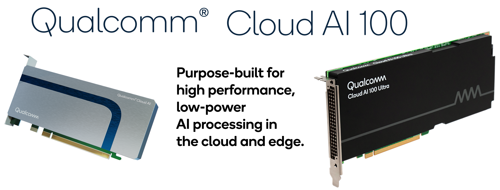

---
# Efficient Transformers Library 
---

*Latest news* :fire:  

- [coming soon] Support for more popular [models](#models-coming-soon) and inference optimization techniques like continuous batching and speculative decoding  
* [06/2024] Added support for [GPT-J-6B](https://huggingface.co/EleutherAI/gpt-j-6b)
- [06/2024] Added support for [Qwen2-1.5B-Instruct](https://huggingface.co/Qwen/Qwen2-1.5B-Instruct)
- [06/2024] Added support for [StarCoder2-15B](https://huggingface.co/bigcode/starcoder2-15b)
- [06/2024] Added support for [Phi3-Mini-4K-Instruct](https://huggingface.co/microsoft/Phi-3-mini-4k-instruct)
- [06/2024] Added support for [Codestral-22B-v0.1](https://huggingface.co/mistralai/Codestral-22B-v0.1)
- [06/2024] Added support for [Vicuna-v1.5](https://huggingface.co/lmsys/vicuna-13b-v1.5)
- [05/2024] Added support for [Mixtral-8x7B](https://huggingface.co/mistralai/Mixtral-8x7B-v0.1) & [Mistral-7B-Instruct-v0.1](https://huggingface.co/mistralai/Mistral-7B-Instruct-v0.1).
- [04/2024] Initial release of [efficient transformers](https://github.com/quic/efficient-transformers) for seamless inference on pre-trained LLMs.

# Overview

## Train anywhere, Infer on Qualcomm Cloud AI with a Developer-centric Toolchain

This library provides reimplemented blocks of LLMs which are used to make the models functional and highly performant on Qualcomm Cloud AI 100.
There are several models which can be directly transformed from a pre-trained original form to a deployment ready optimized form.
For other models, there is comprehensive documentation to inspire upon the changes needed and How-To(s).

## Typically for LLMs, the library provides:
1. Reimplemented blocks from Transformers <link> which enable efficient on-device retention of intermediate states.
2. Graph transformations to enable execution of key operations in lower precision
3. Graph transformations to replace some operations to other mathematically equivalent operations
4. Handling for underflows and overflows in lower precision
5. Patcher modules to map weights of original model's operations to updated model's operations
6. Exporter module to export the model source into a ONNX Graph.
7. Sample example applications and demo notebooks
8. Unit test templates. 

**It is mandatory for each Pull Request to include tests such as**:
1. If the PR is for adding support for a model, the tests should include successful execution of the model post changes (the changes included as part of PR) on Pytorch and ONNXRT. Successful exit criteria is MSE between output of original model and updated model.
2. If the PR modifies any common utilities, tests need to be included to execute tests of all models included in the library.

## Getting Started 

To get started with efficient-transformers, visit our documentation

* [Validated Models](https://quic.github.io/efficient-transformers/source/Validate.html)
* [Models coming soon](https://quic.github.io/efficient-transformers/source/Validate.html#models-coming-soon)
* Installation Guide
    * [Requirements](https://quic.github.io/efficient-transformers/source/Linux_installation.html#)
    * [Linux Installation](https://quic.github.io/efficient-transformers/source/Linux_installation.html)
* Quick Start
    * [Quick Start Guide](https://quic.github.io/efficient-transformers/source/quick_start.html#)
    * [Using High Level API](https://quic.github.io/efficient-transformers/source/quick_start.html#using-high-level-api)
    * [Using Low level API](https://quic.github.io/efficient-transformers/source/quick_start.html#using-low-level-api)
    * [Details on KV Cache Optimization for Cloud AI 100](https://quic.github.io/efficient-transformers/source/kv_change.html)
* Python API
    * [High Level API](https://quic.github.io/efficient-transformers/source/high_level_api.html) 
    * [Low Level API](https://quic.github.io/efficient-transformers/source/low_level_api.html)
    * [Utilities](https://quic.github.io/efficient-transformers/source/other_api.html)

<!-- * Blogs
    * [Train anywhere, Infer on Qualcomm Cloud AI 100](https://www.qualcomm.com/developer/blog/2024/01/train-anywhere-infer-qualcomm-cloud-ai-100)
    * [How to Quadruple LLM Decoding Performance with Speculative Decoding (SpD) and Microscaling (MX) Formats on Qualcomm® Cloud AI 100](https://statics.teams.cdn.office.net/evergreen-assets/safelinks/1/atp-safelinks.html)
    * [Power-efficient acceleration for large language models – Qualcomm Cloud AI SDK](https://www.qualcomm.com/developer/blog/2023/11/power-efficient-acceleration-large-language-models-qualcomm-cloud-ai-sdk)

    * [Qualcomm Cloud AI 100 Accelerates Large Language Model Inference by ~2x Using Microscaling (Mx) Formats](https://www.qualcomm.com/developer/blog/2024/01/qualcomm-cloud-ai-100-accelerates-large-language-model-inference-2x-using-microscaling-mx)
    * [Qualcomm Cloud AI Introduces Efficient Transformers: One API, Infinite Possibilities](https://www.qualcomm.com/developer/blog/2024/05/qualcomm-cloud-ai-introduces-efficient-transformers--one-api--in)
* Reference
    *  [Qualcomm Cloud AI home](https://www.qualcomm.com/products/technology/processors/cloud-artificial-intelligence)
    * [Qualcomm Cloud AI SDK download](https://www.qualcomm.com/products/technology/processors/cloud-artificial-intelligence/cloud-ai-100#Software)
    * [Qualcomm Cloud AI API reference](https://quic.github.io/cloud-ai-sdk-pages/latest/API/)
    * [User Guide](https://quic.github.io/cloud-ai-sdk-pages/)
    * [OCP Microscaling Formats (MX) Specification](https://www.qualcomm.com/developer/blog/2024/05/6.%09https:/www.opencompute.org/documents/ocp-microscaling-formats-mx-v1-0-spec-final-pdf) -->

 
## Acknowledgements
Thanks to:
* Huggingface transformers for work in LLM GenAI modeling implementation
*  ONNX, Pytorch,  ONNXruntime community.

## Support
If you run into any problems with the code, please file Github issues directly to this repo.

## Contributing
This project welcomes contributions and suggestions. Please check the License. Integration with a CLA Bot is underway. 
