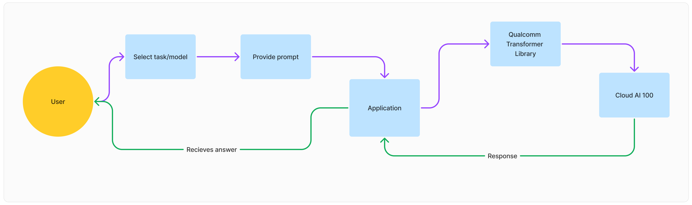

<!-- # -----------------------------------------------------------------------------
#
# Copyright (c)  2023-2024 Qualcomm Innovation Center, Inc. All rights reserved.
# SPDX-License-Identifier: BSD-3-Clause
#
# ----------------------------------------------------------------------------- -->
# Developer Applications on Cloud AI 100 using Transformers Library 


### Instructions to launch the app 
1. Clone the repo `git clone https://github.com/hupreti/efficient-transformers.git`
2. Create `app_config.json` and update the information like given below
3. Create a python3.8 environment `python3.8 -m venv env`
4. Activate the environment `source env/bin/activate`
5. Update pip, `pip install -U pip`
6. Install dependencies from requirements.txt, `pip install -r requirements`
7. Run `python app.py`
8. Open browser https://server_name_or_ip:7881
9. Accept the certificate
10. System Dependencies 
    - `sudo apt-get install ffmpeg`
    - same as the `efficient-transformers`


### Interaction of Developer Application and QEfficient Transformers Library



### Format of "app_config.json"

Please modify the `app_config.json` like below,
- You can add N number of entry
- Each entry in app_config will appear as list in dropdown of tasks
- Each entry inside the `task` will appear as list in dropdown of models

```json
{
  "text-generation" : {  
    "codellama" : {
      "qpc_path" : "<path_to_compiled_container_from_library>",
      "model_name" : "<hf_model_card_name>",
      "prompt_len" : 128,
      "ctx_len" : 1024,
      "device_id" : [0]
    },
    "mpt" : {
      "qpc_path" : "<path_to_compiled_container_from_library>",
      "model_name" : "<hf_model_card_name>",
      "prompt_len" : 128,
      "ctx_len" : 1024,
      "device_id" : [1]
    },
    "llama" : {
      "qpc_path" : "<path_to_compiled_container_from_library>",
      "model_name" : "<hf_model_card_name>",
      "prompt_len" : 128,
      "ctx_len" : 1024,
      "device_id" : [2]
    },
    "mistral" : {
      "qpc_path" : "<path_to_compiled_container_from_library>",
      "model_name" : "<hf_model_card_name>",
      "prompt_len" : 128,
      "ctx_len" : 1024,
      "device_id" : [3]
    }
  },
  "question-answering" : {
  },
  "image-generation" : {
  },
  "multi-modalities" : {
  }

}

```
