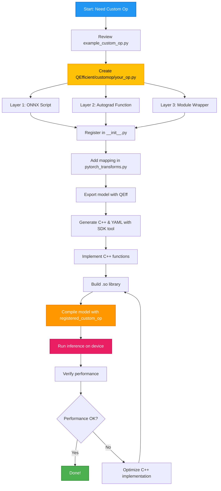

# Adding Custom Operations to QEfficient

Custom ops are hardware optimized implementations of neural network operators for Qualcomm Cloud AI 100. This example walks you through the complete process of creating, registering, and deploying custom operations.

## When to Add Custom Ops

Add custom ops when:

- Replacing standard PyTorch ops with faster hardware-optimized versions
- Implementing operations the compiler doesn't support natively
- Optimizing frequently used operations in your model

## Understanding the 3-Layer Pattern

Every custom op in QEfficient follows a 3-layer architecture:

1. **ONNX Script** - Defines the ONNX representation that gets exported (which the compiler later reads)
2. **PyTorch Autograd Function** - Bridges PyTorch execution and ONNX export
3. **nn.Module Wrapper** - What users interact with in their code

---

## Step 1: Review the Example Template

Before creating a custom op, examine the example template to understand the structure:

**File:** `examples/onboarding_guide/customop/example_custom_op.py`

This file demonstrates a complete custom GELU implementation with all three layers. Study how:
- Constants are defined in the ONNX script
- The autograd function handles both PyTorch execution and ONNX export
- The module wrapper provides a clean user interface

---

## Step 2: Create the Custom Op File

Create a new file under `QEfficient/customop/<op_name>.py` with the following structure:

### Layer 1: ONNX Script

This defines the ONNX representation that PyTorch exports (which the compiler will later read and compile).

```python
import onnxscript
import torch
from torch import nn
from QEfficient.utils import constants

ops = getattr(onnxscript, "opset" + str(constants.ONNX_EXPORT_OPSET))

@onnxscript.script(onnxscript.values.Opset(domain="com.qti.aisw.onnx", version=1))
def CustomOpBluePrint(input: onnxscript.FLOAT):
    """
    ONNX implementation of the operation.
    
    Important constraints:
    - Domain MUST be "com.qti.aisw.onnx" for custom ops
    - Use ops.Constant() for any constant values
    """
    <Code implementation>
```


PyTorch's ONNX exporter uses this to generate the ONNX graph

### Layer 2: PyTorch Autograd Function

This bridges PyTorch execution and ONNX export.

```python
class CustomOpBluePrintFunc(torch.autograd.Function):
    
    @staticmethod
    def forward(input: torch.Tensor, mode: str = "default"):
        """
        PyTorch implementation - can use ANY PyTorch operations.
        This runs during normal PyTorch execution (training, inference, etc.)
        """
        <Code implementation>
    
    @staticmethod
    def setup_context(ctx, inputs, outputs):
        """Store any tensors needed for backward pass (not needed for inference-only ops)"""
        <Code implementation>
    
    @staticmethod
    def symbolic(g: torch.Graph, input: torch.Value, mode: str = "default") -> torch.Value:
        """
        Called during ONNX export - maps to the ONNX script.
        """
        return g.onnxscript_op(CustomOpBluePrint, input)
```

### Layer 3: Module Wrapper

This is the user facing interface.

```python
class CustomOpBluePrintAIC(nn.Module):
    """
    User-facing module wrapper.
    This is what users instantiate and use in their models.
    """
    
    def __init__(self, mode: str = "default"):
        super().__init__()
        pass
    
    def forward(self, input: torch.Tensor) -> torch.Tensor:
        """Forward pass delegates to the autograd function"""
        return CustomOpBluePrintFunc.apply(input, self.mode)
```

Provides a clean, standard `nn.Module` interface

---

## Step 3: Register the Custom Op in Qeff

Add the custom op to `QEfficient/customop/__init__.py`:

```python
from QEfficient.customop.<op_name> import CustomOpBluePrintAIC

__all__ = [
    # ... existing exports ...
    "CustomOpBluePrintAIC",
]
```

This makes the custom op importable from `QEfficient.customop`.

---

## Step 4: Map to PyTorch Transforms

Add the mapping in `QEfficient/transformers/models/pytorch_transforms.py` to automatically replace standard PyTorch modules with the custom op.


### Example from the Codebase

```python
from transformers.activations import NewGELUActivation
from transformers.models.llama.modeling_llama import LlamaRMSNorm
from QEfficient.customop import CustomGELUAIC, CustomRMSNormAIC

class CustomOpsTransform(ModuleMappingTransform):
    _module_mapping = {
        # Activation functions
        NewGELUActivation: CustomGELUAIC,
        
        # Normalization layers
        LlamaRMSNorm: CustomRMSNormAIC,
    }
```

**How the transform works:**
1. When a model is loaded, QEfficient scans all modules
2. For each module type in `_module_mapping`, it replaces the module with the custom implementation
3. The replacement happens automatically before ONNX export

---

## Step 5: Export the Model with QEff

Use QEfficient to export the model with custom ops applied:

```python
from QEfficient import QEFFAutoModelForCausalLM
from transformers import AutoTokenizer

# Model name
model_name = "gpt2"

# Load model - custom ops are automatically applied via transforms
model = QEFFAutoModelForCausalLM.from_pretrained(model_name)

# Export to ONNX
# The custom ops will be included in the ONNX graph
export_path = model.export()

print("Model exported successfully with custom ops!")
print(f"Model path : {export_path}")
```

The export process:
1. Loads the PyTorch model
2. Applies `CustomOpsTransform` to replace standard ops with custom ops
3. Saves the ONNX model

---

## Step 6: Generate C++ and YAML Files

Use the SDK tool to generate the custom op package structure from the ONNX model:

```bash
# Generate custom op package from ONNX model
python /opt/qti-aic/tools/custom-ops/gen_custom_op_package.py \
    --onnx_model path/to/model.onnx \
    --output_dir CustomOp_Package \
    --domain com.qti.aisw.onnx
```

This generates:
```
CustomOp_Package/
├── custom_op_config.yaml          # Op configuration for compiler
└── <CustomOpName>/
    └── src/
        ├── customop_functions.cpp  # Utility functions (to be implemented)
        └── customop_interpreter.cpp # Backend implementation (to be implemented)
```

---

## Step 7: Build the Shared Library

Compile the C++ code into a shared library (.so file) that the runtime can load.

### Reference the SDK Example

See `/opt/qti-aic/examples/apps/custom-op/basic-example/README.md` for detailed instructions.

### Build Command

```bash
# Navigate to the custom op package
cd CustomOp_Package/<CustomOpName>/src

# Compile the shared library
g++ -shared -std=c++11 -fPIC \
    -o customop_lib.so \
    customop_functions.cpp \
    customop_interpreter.cpp \
    -I/opt/qti-aic/dev/inc \
    -I/opt/qti-aic/dev/lib
```

After building, verify the .so file exists:
```bash
ls -lh customop_lib.so
```

---

## Step 8: Compile the Model with Custom Op

Pass the custom op YAML config to the compiler:

```python
from QEfficient import QEFFAutoModelForCausalLM
from transformers import AutoTokenizer

model_name = "gpt2"

# Load model with custom ops
model = QEFFAutoModelForCausalLM.from_pretrained(model_name)

# Compile with custom op - pass the YAML config path
model.compile(
    num_cores=16,
    registered_custom_op="CustomOp_Package/custom_op_config.yaml"
)

print("Model compiled successfully with custom op!")
```
---


## Workflow Summary

Here's the complete workflow from start to finish:

### Quick Reference

1.  **Review** `example_custom_op.py` to understand the 3-layer pattern
2.  **Create** `QEfficient/customop/your_op.py` with ONNX script, autograd function, and module wrapper
3.  **Register** in `QEfficient/customop/__init__.py`
4.  **Map** in `QEfficient/transformers/models/pytorch_transforms.py`
5.  **Export** model with QEff (custom ops automatically applied)
6.  **Generate** C++ and YAML files using SDK tool
7.  **Implement** C++ functions and build .so library
8.  **Compile** model with `registered_custom_op` parameter

### Workflow Diagram



### Key Files Reference

| Purpose | File Path |
|---------|-----------|
| Example template | `examples/onboarding_guide/customop/example_custom_op.py` |
| SDK custom op tool | `/opt/qti-aic/tools/custom-ops/gen_custom_op_package.py` |
| SDK examples | `/opt/qti-aic/examples/apps/custom-op/` |

---

## Examples and References

### Example Implementations

- **`example_custom_op.py`** - Complete template showing the 3-layer pattern
- **`example_pytorch_transforms.py`** - How to register custom ops in transforms
- **`QEfficient/customop/rms_norm.py`** - Real implementation with learnable parameters
- **`QEfficient/customop/ctx_scatter_gather.py`** - Advanced custom op example

### Documentation

- **[Custom Ops Directory](../../../QEfficient/customop/)** - All custom op implementations
- **[PyTorch Transforms](../../../QEfficient/transformers/models/pytorch_transforms.py)** - Transform registry
- **[SDK Custom Op Documentation](/opt/qti-aic/examples/apps/custom-op)** - Hardware-specific details
- **[Contributing Guide](../../../CONTRIBUTING.md)** - How to contribute custom ops
